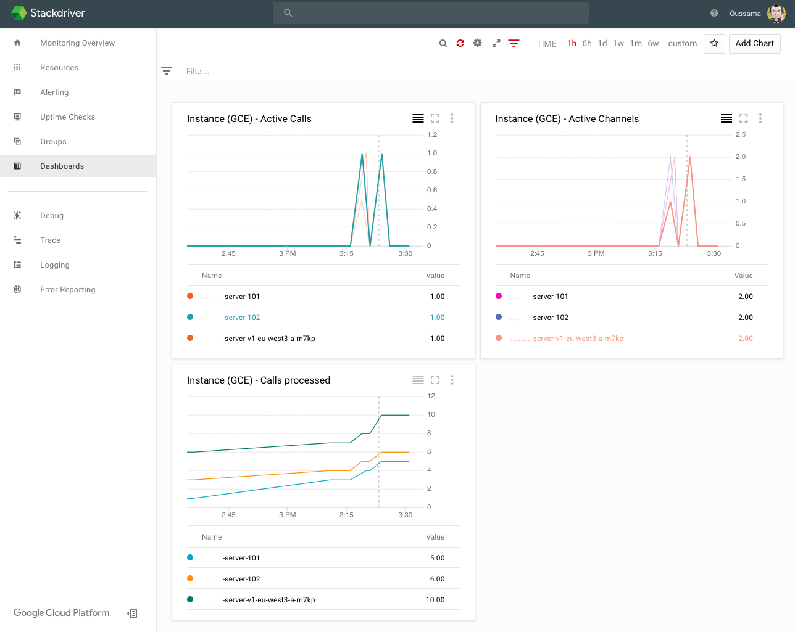

# Asterisk Stackdriver Monitoring

Simple Bash script to export `active channels`, `active calls` and `calls processed` to **Stackdriver** Custom Metrics.



**NB** You have to create Asterisk custom metrics within your GCP Console projects before deploying this script.

## Create Asterisk custom metrics

the easier way is to use [metricDescriptors.create](https://developers.google.com/apis-explorer/#p/monitoring.googleapis.com/v3/monitoring.projects.metricDescriptors.create) unless you're a curl pro :sunglasses:

Then use below values: 

**`name`** : `projects/[YOUR-GCP-PROJECT-ID]`

### Active Channels `Request body`

```
{
  "name": "",
  "description": "Active channels in all media servers.",
  "displayName": "active channels",
  "type": "custom.googleapis.com/active_channels",
  "metricKind": "GAUGE",
  "valueType": "DOUBLE",
  "unit": "{channel}",
  "labels": [
    {
      "key": "project_id",
      "valueType": "STRING",
      "description": "The identifier of the GCP project associated with this resource (e.g., {your-project-id})."
    },
    {
      "key": "instance_id",
      "valueType": "STRING",
      "description": "The VM instance identifier assigned by GCE."
    },
    {
      "key": "zone",
      "valueType": "STRING",
      "description": "The GCE zone in which the VM is running."
    },
  ],

}
```

### Active Calls `Request body`

```
{
  "name": "",
  "description": "Active calls in all media servers.",
  "displayName": "active calls",
  "type": "custom.googleapis.com/active_calls",
  "metricKind": "GAUGE",
  "valueType": "DOUBLE",
  "unit": "{call}",
  "labels": [
    {
      "key": "project_id",
      "valueType": "STRING",
      "description": "The identifier of the GCP project associated with this resource (e.g., {your-project-id})."
    },
    {
      "key": "instance_id",
      "valueType": "STRING",
      "description": "The VM instance identifier assigned by GCE."
    },
    {
      "key": "zone",
      "valueType": "STRING",
      "description": "The GCE zone in which the VM is running."
    },
  ],

}
```

### Calls Processed `Request body`

```
{
  "name": "",
  "description": "Calls processed in all media servers.",
  "displayName": "calls processed",
  "type": "custom.googleapis.com/calls_processed",
  "metricKind": "GAUGE",
  "valueType": "DOUBLE",
  "unit": "{call}",
  "labels": [
    {
      "key": "project_id",
      "valueType": "STRING",
      "description": "The identifier of the GCP project associated with this resource (e.g., {your-project-id})."
    },
    {
      "key": "instance_id",
      "valueType": "STRING",
      "description": "The VM instance identifier assigned by GCE."
    },
    {
      "key": "zone",
      "valueType": "STRING",
      "description": "The GCE zone in which the VM is running."
    },
  ],

}
```
### Additional informations

**To check Metrics**

>use [metricDescriptors.get](https://developers.google.com/apis-explorer/#p/monitoring.googleapis.com/v3/monitoring.projects.metricDescriptors.get)
>
>* **`name`** :
>
>> * projects/[YOUR-GCP-PROJECT-ID]/metricDescriptors/custom.googleapis.com/active_calls
>> * projects/[YOUR-GCP-PROJECT-ID]/metricDescriptors/custom.googleapis.com/active_channels
>> * projects/[YOUR-GCP-PROJECT-ID]/metricDescriptors/custom.googleapis.com/calls_processed

**To delete Metrics**

>use [metricDescriptors.delete](https://developers.google.com/apis-explorer/#p/monitoring.googleapis.com/v3/monitoring.projects.metricDescriptors.delete)
>
>* **`name`** :
>
>> * projects/[YOUR-GCP-PROJECT-ID]/metricDescriptors/custom.googleapis.com/calls_processed
>> * projects[YOUR-GCP-PROJECT-ID]metricDescriptors/custom.googleapis.com/active_calls
>> * projects/[YOUR-GCP-PROJECT-ID]/metricDescriptors/custom.googleapis.com/active_channels

**Maualy create timeSeries points**

>use [monitoring.projects.timeSeries.create](https://developers.google.com/apis-explorer/#p/monitoring.googleapis.com/v3/monitoring.projects.timeSeries.create)
>
>**`name`** : `projects/[YOUR-GCP-PROJECT-ID]`

* **Calls Processed** `Request body`

```
{
  "timeSeries": 
  [
    {
      "metric": 
      {
        "type": "custom.googleapis.com/calls_processed"
      },
      "resource": 
      {
        "type": "gce_instance",
        "labels": 
        {
          "instance_id": "[GCP-INSTANCE-ID]",
          "zone": "[GCP-ZONE]",
          "project_id": "[YOUR-GCP-PROJECT-ID]"
        }
      },
      "points": 
      [
        {
          "interval": 
          {
            "endTime": "2018-02-20T13:45:20.187Z"
          },
          "value": 
          {
            "doubleValue": 101
          }
        }
      ]
    }
  ]
}
```

* **Active calls** `Request body`
 
```
{
  "timeSeries": 
  [
    {
      "metric": 
      {
        "type": "custom.googleapis.com/active_calls"
      },
      "resource": 
      {
        "type": "gce_instance",
        "labels": 
        {
          "instance_id": "[GCP-INSTANCE-ID]",
          "zone": "[GCP-ZONE]",
          "project_id": "[YOUR-GCP-PROJECT-ID]"
        }
      },
      "points": 
      [
        {
          "interval": 
          {
            "endTime": "2018-02-20T13:45:20.187Z"
          },
          "value": 
          {
            "doubleValue": 10
          }
        }
      ]
    }
  ]
}
```

* **Active channels** `Request body`

```
{
  "timeSeries": 
  [
    {
      "metric": 
      {
        "type": "custom.googleapis.com/active_channels"
      },
      "resource": 
      {
        "type": "gce_instance",
        "labels": 
        {
          "instance_id": "[GCP-INSTANCE-ID]",
          "zone": "[GCP-ZONE]",
          "project_id": "[YOUR-GCP-PROJECT-ID]"
        }
      },
      "points": 
      [
        {
          "interval": 
          {
            "endTime": "2018-02-20T13:45:20.187Z"
          },
          "value": 
          {
            "doubleValue": 20
          }
        }
      ]
    }
  ]
}
```

## Installation

* Download [`asterisk_stat.sh`](./asterisk_stat.sh) in your gcp instance running Asterisk.
* Edit the script to change this part in the beginning:

 ```
 # Replace with yours
 
 gcp_project_id="YOUR-GCP-PROJECT-ID"
 gcp_instance_id="GCP-INSTANCE-ID"
 gcp_zone="GCP-ZONE"
 ```
* Add a cron job in your asterisk instance

 **`/etc/cron.d/asterisk-start`**

 ```
 PATH=/sbin:/usr/sbin:/bin:/usr/bin
 
 # Start job every 5 minutes
 */5 * * * * root /etc/asterisk/bin/asterisk_stat.sh >> /var/log/cron.log 2>&1
 ```

**NB** For the log rotation, check that the file `/var/log/cron.log` is including in `/etc/logrotate.d/syslog`

## Requirements

Only `bash`, `curl` and `asterisk`.

## Notes & Ref

Please feel free to fork and modify !

* [Creating and Enabling Service Accounts for Instances](https://cloud.google.com/compute/docs/access/create-enable-service-accounts-for-instances)
* [Creating Custom Metrics](https://cloud.google.com/monitoring/custom-metrics/creating-metrics)
* [Using Custom Metrics](https://cloud.google.com/monitoring/custom-metrics/)
* [OAuth 2.0 for Client-side Web Applications](https://developers.google.com/identity/protocols/OAuth2UserAgent#callinganapi)
* [Create a dashboard and chart](https://cloud.google.com/monitoring/quickstart-lamp#gs-dashboards)

**Todo**

* [Custom Metrics from the Agent](https://cloud.google.com/monitoring/agent/custom-metrics-agent)
